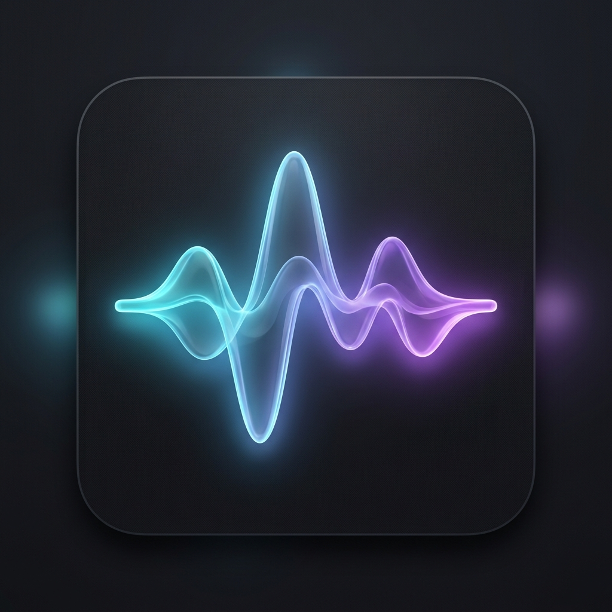
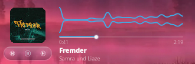

<p align="center">
  
</p>

# Plasma Audio Wave Visualizer

[](https://www.opendesktop.org/p/2359422/)

<p align="center">
  
</p>

A glassy audio visualizer plasmoid for KDE Plasma 6. Renders mirrored waveform that reacts to whatever is playing system-wide (via [cava]), alongside MPRIS track metadata, album art, transport controls, and a seekable progress bar.



## Features

- System-wide reactive waveform (PipeWire via cava — not tied to any single player)
- MPRIS2 track info: title, artist, album art
- Transport controls (prev / play-pause / next)
- Seekable progress bar with elapsed/total time
- Honors the active Plasma accent color
- No panel background — sits cleanly on any panel

## Requirements

- KDE Plasma **6.0+**
- [`cava`][cava] (audio bar generator)
- `flock` (from `util-linux`) and `pkill` (from `procps`) — both standard on virtually every Linux distro

[cava]: https://github.com/karlstav/cava

## Install

### Manual install (any distro)

```bash
git clone https://github.com/muddyblack/plasma-audio-visualizer.git
cd plasma-audio-visualizer
kpackagetool6 -t Plasma/Applet -i package
# or, to update an existing install:
kpackagetool6 -t Plasma/Applet -u package
```

Then add the widget from Plasma's "Add Widgets" panel.

To remove: `kpackagetool6 -t Plasma/Applet -r org.muddyblack.plasmaAudioVisualizer`

### NixOS (flake)

```nix
# flake.nix
{
  inputs.audio-wave.url = "github:muddyblack/plasma-audio-visualizer";

  outputs = { self, nixpkgs, audio-wave, ... }: {
    nixosConfigurations.mybox = nixpkgs.lib.nixosSystem {
      modules = [
        ({ pkgs, ... }: {
          environment.systemPackages = [
            audio-wave.packages.${pkgs.system}.default
            pkgs.cava
          ];
        })
      ];
    };
  };
}
```

### Package as `.plasmoid` (for KDE Store)

```bash
./pack.sh
# produces plasma-audio-visualizer-<version>.plasmoid
```

## How it works

The widget can't read PipeWire directly from QML, so a small shell helper (`feeder.sh`) runs `cava` in the background and atomically writes the latest bars to `$XDG_RUNTIME_DIR/audio-wave-widget/bars`. The QML side polls that file at ~30 fps. A `flock` ensures only one feeder runs even if Plasma respawns the widget. On unload, `pkill -f` cleans up the helper.

## Tweaking

- Bar count, framerate, sensitivity: edit `package/contents/code/cava.conf` and reinstall.
- Visual style: `package/contents/ui/main.qml`.